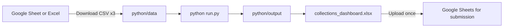

# Python pipeline (no Apps Script)

This repo uses a **Python-only** implementation (Apps Script removed). Use it to:
- validate CSV exports from Google Sheets,
- compute receivables + outstanding (single calculation layer),
- generate Task A email previews (dry-run) + audit logs,
- generate Task B dashboard artifacts (HTML + Excel → upload to Google Sheets),
- optionally keep the outputs continuously refreshed via GitHub Actions cron.

## Workflow



## Steps

1. Export tabs from your workbook: **File → Download → CSV** → save as `customers.csv`, `shipments.csv`, `payments.csv` under `python/data/`.
2. `cd python` → `pip install -r requirements.txt`
3. `python run.py all` (validate → receivables → reminders → monthly → dashboard)
4. Open `output/dashboard.html` for review.
5. Upload `output/collections_dashboard.xlsx` to Google Drive → Open with Google Sheets for Task B deliverable.

## Optional: auto-download CSV

If the sheet is shared for viewing, try:

```bash
python run.py fetch-data
```

This uses Google’s CSV export URL (may require “Anyone with link can view”).

## Optional: send real emails

Set in `python/config.yaml`:

```yaml
email:
  enabled: true
  smtp_host: smtp.gmail.com
  smtp_port: 587
  sender: your@gmail.com
  app_password: "xxxx"  # Gmail App Password
```

Default is **dry-run** (files only).

## What to submit

- `deploy/` artifacts (latest run) or `python/output/` (same files)
- A Google Sheets link created by uploading `collections_dashboard.xlsx`
- Short note: “Automation implemented in Python; refresh via GitHub Actions cron; emails are dry-run previews for safety”
