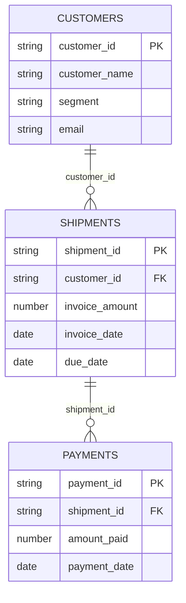
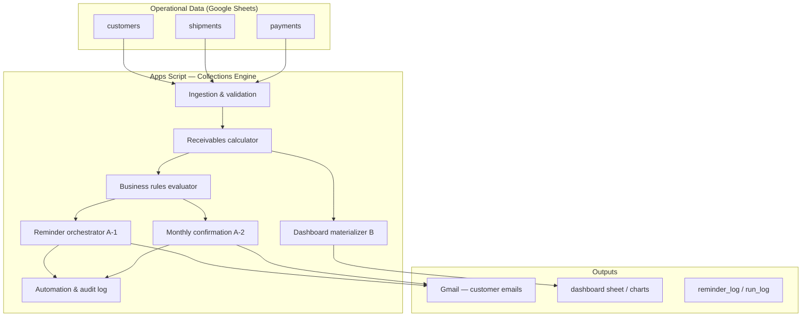
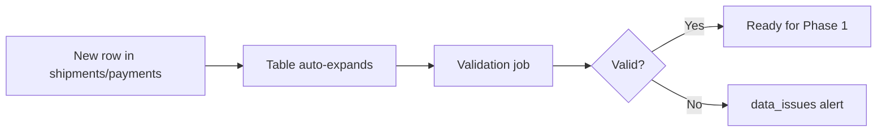
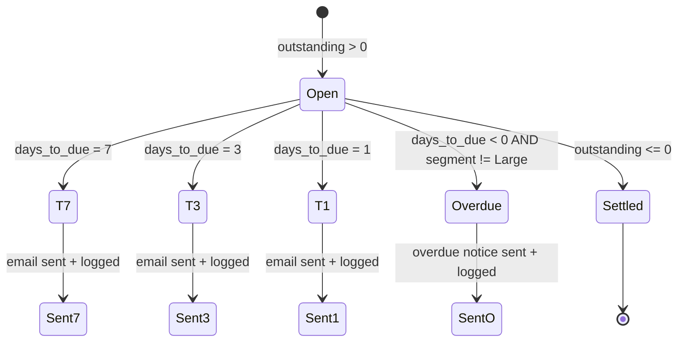
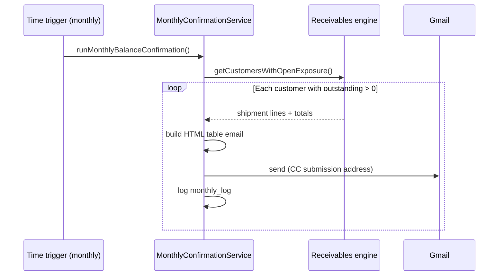
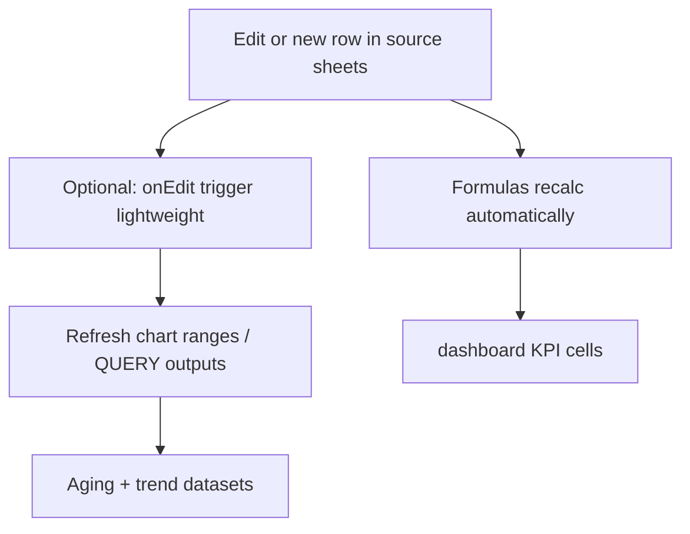
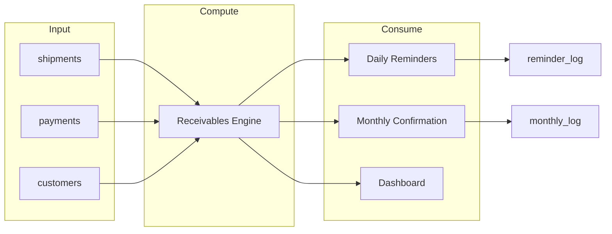

# Recykal Collections Intelligence System — Phase-Wise Architecture

> **Note (2026-05):** The Apps Script track was removed from this repository (it was not working reliably for the submission).  
> The current, recruiter-facing architecture is **Python-only**: **[docs/architecture-python.md](./architecture-python.md)**.
>
> This document is kept as a *legacy* phase-wise plan and may reference Apps Script components that no longer exist in the repo.

**Document purpose:** Define a phased, implementable architecture for the Recykal Strategy Analyst Intern assessment: an Automated Payment Reminder & Balance Confirmation System plus a Real-Time Collections Dashboard, built on live transactional data.

**Source:** [recykal problem statement.md](./recykal%20problem%20statement.md)

**Target platform (legacy):** Google Sheets + Google Apps Script + Gmail

---

## 1. Executive Summary

Recykal’s collections workflow breaks down at scale because invoice status, partial payments, due dates, and customer segments must be reconciled continuously. The proposed solution is a **lightweight collections intelligence layer** that sits on top of three linked datasets (`customers`, `shipments`, `payments`) and delivers:

| Capability | Primary deliverable |
|------------|---------------------|
| Proactive follow-up | Scheduled reminder emails (7d / 3d / 1d / overdue) |
| Reconciliation | Monthly consolidated balance confirmation per customer |
| Operational visibility | Live dashboard: KPIs, customer exposure, aging, 30-day trend |

Implementation is organized into **six phases** (0–5): foundation → core receivables engine → reminders → monthly confirmation → dashboard → hardening & documentation. Each phase produces testable artifacts and does not block the next on manual data entry.

---

## 2. System Context

### 2.1 Stakeholders & actors

| Actor | Role |
|-------|------|
| Collections team | Consumes dashboard; handles exceptions and Large-segment overdue follow-up manually |
| Recyclers (customers) | Receive reminder and balance-confirmation emails |
| Operations / finance | Maintains master and transactional sheets (or upstream ETL adds rows) |
| System (Apps Script) | Computes balances, triggers emails, refreshes dashboard |

### 2.2 Data domains



### 2.3 Design principles (from technical expectations)

1. **Dynamic ranges** — All reads/writes use table bounds (`getDataRange()`, named tables, or last-row detection); no fixed row numbers.
2. **Single source of truth for balances** — One receivables computation module feeds reminders, monthly emails, and dashboard.
3. **Idempotent automation** — Reminder sends are gated by a send log to prevent duplicate emails on re-runs.
4. **Business rules as configuration** — Reminder windows, CC address, Large-segment exclusion, and aging buckets live in a `Config` sheet or script constants for auditability.
5. **Fail-safe communication** — No email when outstanding ≤ 0; overdue notices skipped for `segment = Large`.

---

## 3. High-Level Architecture



### 3.1 Recommended workbook structure

| Sheet | Purpose |
|-------|---------|
| `customers` | Master: `customer_id`, name, `segment`, contact email |
| `shipments` | Invoices: `shipment_id`, `customer_id`, `invoice_amount`, `invoice_date`, `due_date` |
| `payments` | Installments: `payment_id`, `shipment_id`, `amount_paid`, `payment_date` |
| `receivables_computed` | Materialized view: per-shipment paid, outstanding, days to/from due, flags |
| `dashboard` | KPIs, tables, chart data ranges (formula-driven or script-refreshed) |
| `config` | CC email, segment rules, bucket definitions, sender name |
| `reminder_log` | shipment_id, reminder_type, sent_at — deduplication |
| `monthly_log` | customer_id, period, sent_at — deduplication |

---

## 4. Core Receivables Logic (Cross-Cutting)

All phases depend on **accurate outstanding balance**. This logic is implemented once and consumed everywhere.

### 4.1 Per-shipment calculations

```
amount_paid     = SUM(payments.amount_paid WHERE shipment_id = X)
outstanding     = invoice_amount - amount_paid
is_settled      = outstanding <= 0  (use epsilon for float if needed)
days_to_due     = due_date - TODAY()   (negative if overdue)
days_overdue    = MAX(0, TODAY() - due_date)
```

### 4.2 Eligibility flags

| Flag | Rule |
|------|------|
| `eligible_for_reminder` | `NOT is_settled` |
| `eligible_for_overdue` | `NOT is_settled AND TODAY() > due_date AND segment != 'Large'` |
| `in_7d_window` | `days_to_due = 7` |
| `in_3d_window` | `days_to_due = 3` |
| `in_1d_window` | `days_to_due = 1` |

**Note:** Trigger windows should be evaluated on **calendar date equality** (due_date - 7 days = today) to avoid off-by-one errors with time zones; Apps Script `Utilities.formatDate` with spreadsheet timezone.

### 4.3 Partial payments

- Multiple payment rows per `shipment_id` are aggregated before any email or KPI.
- Email body always shows **Invoice Amount**, **Amount Paid**, **Outstanding Balance** (not original invoice only).

---

## 5. Phase-Wise Implementation Architecture

---

### Phase 0 — Foundation & Data Contract

**Goal:** Establish a stable, scalable data foundation and validation before automation.

#### Workbooks

| Role | Workbook | URL / ID |
|------|----------|----------|
| **Solution (editable)** | Your working copy | [Spreadsheet](https://docs.google.com/spreadsheets/d/1FRzRXR5Wp8RObFKaykUKHrWSsbI9dDr_w1hnBsvm8to/edit?gid=1296664018#gid=1296664018) · `1FRzRXR5Wp8RObFKaykUKHrWSsbI9dDr_w1hnBsvm8to` |
| **Reference data** | Recykal_Intern_Data | [Original](https://docs.google.com/spreadsheets/d/177AdQbbkhVgAuoDARJOhtsB4lngpHK8fgHu_4NkQxJ4/edit?gid=2064198405#gid=2064198405) · `177AdQbbkhVgAuoDARJOhtsB4lngpHK8fgHu_4NkQxJ4` |

Tabs: `customers` · `shipments` · `payments` (plus solution tabs from Phase 0+).

Bind Apps Script to the **editable** workbook. All ingestion, validation, and automation use that file as the system of record.

| Workstream | Deliverables |
|------------|--------------|
| Schema definition | Documented column types, required fields, PK/FK for three source sheets |
| Data quality checks | Script or formula checks: orphan `shipment_id` in payments, missing `customer_id`, duplicate PKs |
| Config sheet | CC: `ai-strategy-interns-case-submissionsleads@recykal.com`, segment enum, timezone |
| Named ranges / Tables | Convert raw sheets to Sheet Tables for dynamic expansion |
| Access & triggers placeholder | Apps Script project bound to workbook; empty `onOpen` menu for ops |

**Exit criteria**

- [ ] New rows appended to `shipments` / `payments` auto-participate in formulas (no range edit)
- [ ] Invalid FK rows flagged in a `data_issues` range or log

**Risks mitigated:** Silent calculation errors from broken relationships.

**Edge cases:** [phase-0-edge-cases.md](./edge-cases/phase-0-edge-cases.md)



---

### Phase 1 — Receivables Engine & Materialized View

**Goal:** Build the **single calculation layer** that powers Task A and Task B.

| Component | Responsibility |
|-----------|----------------|
| `ReceivablesService` | Load customers, shipments, payments into maps keyed by `shipment_id` / `customer_id` |
| `computeShipmentState()` | Returns paid, outstanding, settled, due metadata |
| `receivables_computed` sheet | Optional persistence for debugging; refreshed on schedule or on edit |
| `getOpenShipmentsForCustomer()` | List unpaid + partial for monthly email |

**Implementation options**

| Approach | Pros | Cons |
|----------|------|------|
| **A. Formula-based staging** | Transparent to evaluators; updates on every edit | Complex ARRAYFORMULA for multi-payment join |
| **B. Script-based refresh** | Easier joins and segment rules | Requires trigger for “real-time” feel |
| **Hybrid (recommended)** | ARRAYFORMULA for outstanding on shipments; script for aging buckets & emails | Best balance of live dashboard + clear email logic |

**Exit criteria**

- [ ] Partial payment scenario: invoice 100k, payments 30k + 20k → outstanding 50k
- [ ] Fully paid shipment excluded from open lists
- [ ] Unit-testable pure functions in `.gs` files (mock sheet data)

**Edge cases:** [phase-1-edge-cases.md](./edge-cases/phase-1-edge-cases.md)

---

### Phase 2 — Task A-1: Automated Payment Reminder System

**Goal:** Scheduled, rule-compliant reminder emails with deduplication and mandatory CC.

#### 2.1 Reminder state machine



#### 2.2 Orchestration design

| Function | Schedule | Behavior |
|----------|----------|----------|
| `runDailyReminderJob()` | Time-driven, daily (e.g. 08:00 IST) | Scan all open shipments; evaluate windows |
| `evaluateReminderType(shipment)` | — | Returns `7D` \| `3D` \| `1D` \| `OVERDUE` \| null |
| `shouldSend(shipment, type)` | — | Checks `reminder_log` for same shipment_id + type + due_date cycle |
| `buildReminderEmail(shipment)` | — | Template with all required fields |
| `sendEmail()` | — | To customer email; CC config address |

#### 2.3 Email content contract

Every reminder includes:

- Customer Name  
- Shipment ID  
- Invoice Amount  
- Amount Paid  
- Outstanding Balance  
- Due Date  
- Days until or since due date  

#### 2.4 Business rule enforcement

| Rule | Implementation |
|------|----------------|
| No reminders if settled | Early return when `outstanding <= 0` |
| Large segment | Skip `OVERDUE` only; 7/3/1-day reminders still allowed per problem statement (exclusion specified for overdue notices) |
| CC always | `GmailApp.sendEmail({ cc: CONFIG.SUBMISSION_CC })` |
| Duplicate prevention | `reminder_log` unique key: `shipment_id + reminder_type + due_date` |

**Exit criteria**

- [ ] Test matrix: settled, partial, unpaid, Large overdue, non-Large overdue  
- [ ] Manual dry-run mode (`DRY_RUN=true` logs without send)  
- [ ] All four trigger windows verified with fixture dates  

**Edge cases:** [phase-2-edge-cases.md](./edge-cases/phase-2-edge-cases.md)

---

### Phase 3 — Task A-2: Monthly Balance Confirmation

**Goal:** On the 1st of each month, one consolidated email per customer with full open exposure.

#### 3.1 Workflow



#### 3.2 Email structure

- **Per shipment row:** shipment_id, invoice amount, paid, outstanding, due date (optional status)  
- **Footer:** total outstanding exposure across all open/partial shipments  
- **Reply-to / instructions:** Short copy inviting confirm or dispute via reply (operational, not automated dispute handling)

#### 3.3 Scheduling

| Trigger | Cron |
|---------|------|
| `runMonthlyBalanceConfirmation` | 1st of month, 09:00 (timezone from `config`) |

**Deduplication:** `monthly_log(customer_id, yyyy-MM)` prevents double send if trigger fires twice.

**Exit criteria**

- [ ] Customer with 0 outstanding receives no email  
- [ ] Customer with mix of unpaid + partial gets one email with correct total  
- [ ] CC on all monthly emails  

**Edge cases:** [phase-3-edge-cases.md](./edge-cases/phase-3-edge-cases.md)

---

### Phase 4 — Task B: Real-Time Collections Dashboard

**Goal:** Live operational view in Google Sheets without hardcoded ranges or manual refresh.

#### 4.1 Dashboard layout

| Section | Metrics / visualization |
|---------|-------------------------|
| **Summary KPIs** | Total Invoice Value, Total Collected, Total Outstanding, # Overdue Shipments |
| **Outstanding by Customer** | Table sorted DESC by outstanding; columns: customer, segment, # open shipments, total outstanding |
| **Invoice aging** | Bucket totals: Not Yet Due, 1–30, 31–60, 61+ days overdue |
| **Daily collections trend** | Bar/line chart: sum(`amount_paid`) by `payment_date` for last 30 days |

#### 4.2 “Real-time” update strategy



| KPI | Formula approach |
|-----|------------------|
| Total Invoice Value | `SUM(shipments[invoice_amount])` |
| Total Collected | `SUM(payments[amount_paid])` |
| Total Outstanding | `SUM(outstanding per shipment)` from receivables join |
| Overdue count | `COUNTIF` open shipments where `today > due_date` |

**Aging buckets (outstanding > 0 only)**

| Bucket | Condition |
|--------|-----------|
| Not Yet Due | `today <= due_date` |
| 1–30 Days Overdue | `1 <= today - due_date <= 30` |
| 31–60 | `31 <= diff <= 60` |
| 61+ | `diff >= 61` |

Use `QUERY` or `SUMIFS` on a hidden `dashboard_data` tab fed by receivables columns.

#### 4.3 Chart: daily collections (30 days)

- Helper column: unique dates last 30 days  
- `SUMIFS(payments.amount_paid, payment_date, date)`  
- Insert chart bound to dynamic range (`OFFSET` or table reference)

**Exit criteria**

- [ ] Append 10 new payment rows → trend and KPIs update without script edit  
- [ ] Aging totals reconcile to total outstanding  
- [ ] Customer table sort is descending by exposure  

**Edge cases:** [phase-4-edge-cases.md](./edge-cases/phase-4-edge-cases.md)

---

### Phase 5 — Integration, Observability & Documentation

**Goal:** Production-like reliability for continuous live data and evaluator-ready reasoning.

| Workstream | Items |
|------------|-------|
| **Unified scheduling** | Document all triggers: daily reminders, monthly confirmation, optional nightly receivables refresh |
| **Logging** | `run_log`: timestamp, job name, emails sent, errors |
| **Error handling** | Try/catch per email; continue batch; surface failures in `run_log` and optional admin email |
| **Security** | Least privilege; no secrets in sheet cells; use Script Properties if needed |
| **Testing playbook** | Fixture dates for reminder windows; sample customers Large vs non-Large |
| **Operator menu** | Custom menu: Run Reminders Now, Refresh Dashboard, Dry Run Monthly |
| **Documentation** | README: assumptions, formula index, trigger setup screenshots |

**Exit criteria**

- [ ] End-to-end run on sample dataset with expected emails and dashboard numbers  
- [ ] Architecture and business rules traceable to problem statement sections  

**Edge cases:** [phase-5-edge-cases.md](./edge-cases/phase-5-edge-cases.md) · Index: [edge-cases/README.md](./edge-cases/README.md)

---

## 6. Apps Script Module Structure (Recommended)

```
src/
├── Config.gs              // CC, segments, dry-run, timezone
├── DataAccess.gs          // Read tables dynamically
├── ReceivablesService.gs  // Core outstanding logic
├── ReminderService.gs     // A-1 orchestration
├── MonthlyConfirmation.gs // A-2
├── DashboardService.gs    // Optional script refresh for charts
├── EmailTemplates.gs      // HTML/text builders
├── Logger.gs              // reminder_log, monthly_log, run_log
├── Triggers.gs            // create/delete installable triggers
└── Main.gs                // Menu + manual test entry points
```

---

## 7. Scheduling & Trigger Matrix

| Job | Type | Frequency | Phase |
|-----|------|-----------|-------|
| `runDailyReminderJob` | Time-driven | Daily | 2 |
| `runMonthlyBalanceConfirmation` | Time-driven | Monthly (1st) | 3 |
| `refreshReceivablesView` | Time-driven (optional) | Hourly or on-demand | 1 |
| `onOpen` | Simple | User opens sheet | 5 |
| `validateData` | Time-driven (optional) | Weekly | 0 |

Installable triggers required for sending mail on schedule (not simple `onEdit`).

---

## 8. Data Flow — End-to-End



---

## 9. Evaluation Alignment

| Evaluation area | Architectural answer |
|-----------------|----------------------|
| Outstanding accuracy | Phase 1 single engine; partial payments aggregated before any consumer |
| Business rules | Phase 2–3 rule evaluator; Large exclusion only on overdue; mandatory CC in Config |
| Dashboard usefulness | Phase 4 KPI + customer priority + aging + 30-day trend; dynamic tables |
| Originality | Hybrid formula + script; deduplication logs; dry-run ops menu; optional AI assist for email copy variants (non-blocking) |
| Documentation | Phase 5 + this document |

---

## 10. Assumptions & Constraints

| # | Assumption |
|---|------------|
| 1 | Source data lives in the same Google Spreadsheet (or linked sheets with IMPORTRANGE if split). |
| 2 | `customers.email` is populated for all reminder targets. |
| 3 | `segment` value for Large customers matches exact business enum (`Large` in source data; also `Mid`, `SME`). |
| 4 | Credit terms are reflected in precomputed `due_date` on shipments (not computed from terms in v1). |
| 5 | Currency and number formats are consistent; outstanding uses same unit as invoice. |
| 6 | One workbook bound to one Apps Script project for trigger simplicity. |
| 7 | “Real-time” means recalc on data change without manual copy-paste; sub-minute latency is acceptable. |

---

## 11. Phase Timeline (Suggested)

| Phase | Focus | Relative effort |
|-------|--------|-----------------|
| 0 | Foundation | 10% |
| 1 | Receivables engine | 25% |
| 2 | A-1 Reminders | 25% |
| 3 | A-2 Monthly | 15% |
| 4 | Dashboard | 20% |
| 5 | Hardening & docs | 5% |

Phases 2 and 4 can proceed in parallel once Phase 1 is complete.

---

## 12. Success Metrics (Operational)

| Metric | Target behavior |
|--------|-----------------|
| Reminder coverage | 100% of eligible open invoices evaluated daily |
| False positives | 0 reminders on fully paid shipments |
| Outstanding accuracy | Dashboard outstanding = sum of per-shipment (invoice − payments) |
| Manual effort | No daily range updates; collections uses dashboard only for prioritization |
| Auditability | Every sent email traceable in `reminder_log` / `monthly_log` |

---

## 13. Future Enhancements (Out of Scope for MVP)

- Escalation tiers beyond four reminder types  
- Dispute workflow parsing inbound replies with AI  
- BigQuery / Looker for enterprise scale  
- WhatsApp/SMS channel by segment  
- Predictive “risk of delay” scoring per customer  

---

*This architecture is designed to be implemented incrementally: each phase delivers verifiable value while keeping receivables logic centralized and aligned with Recykal’s business rules.*
